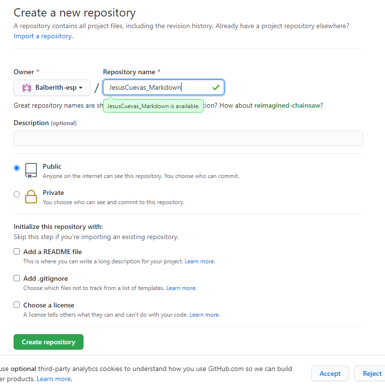
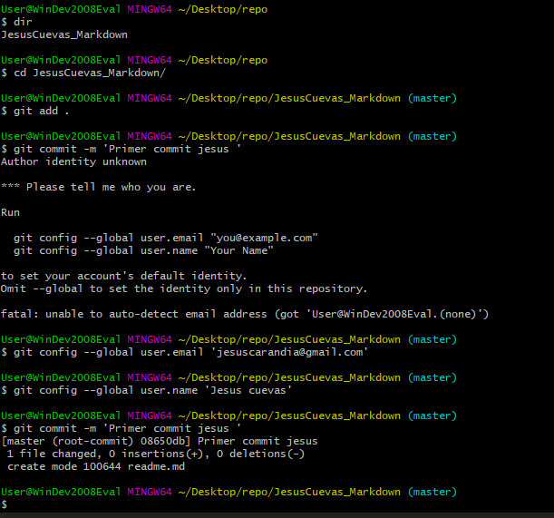
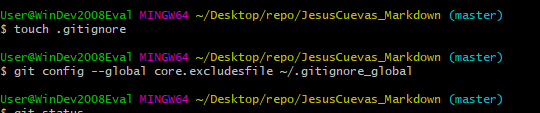
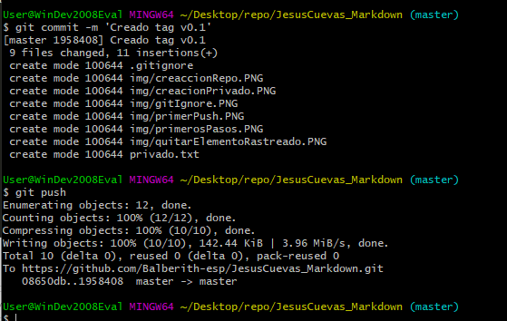
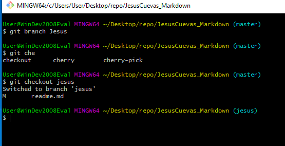
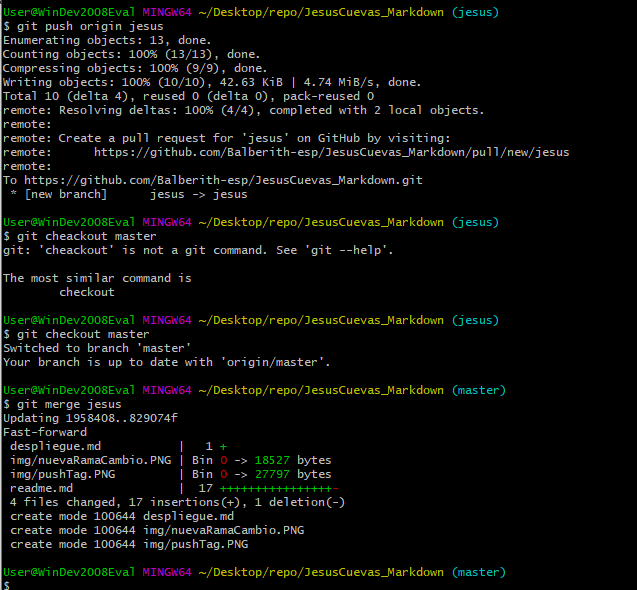
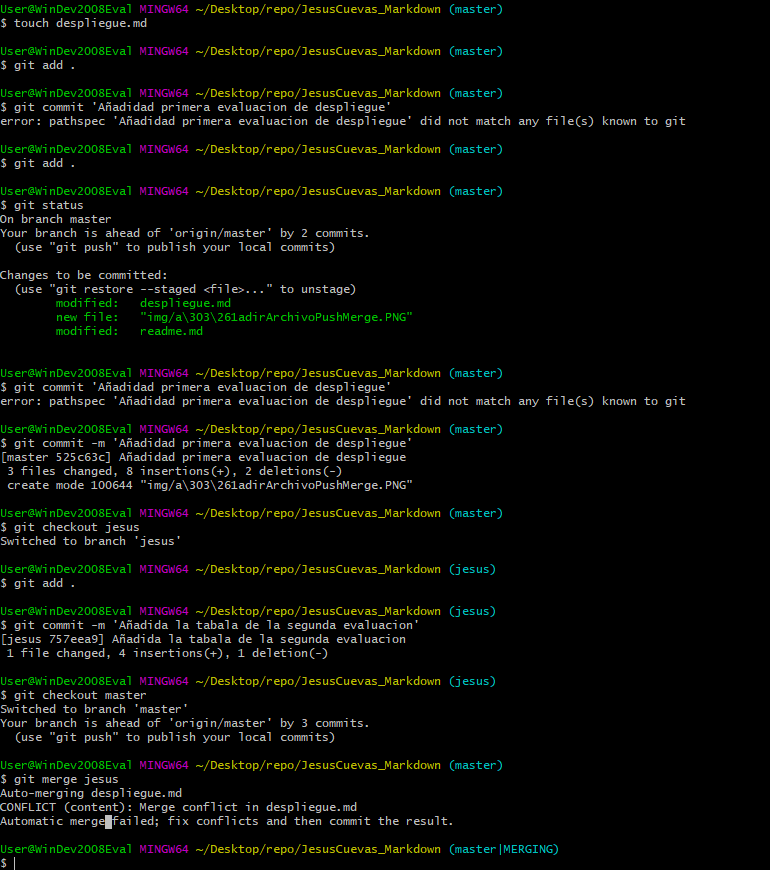
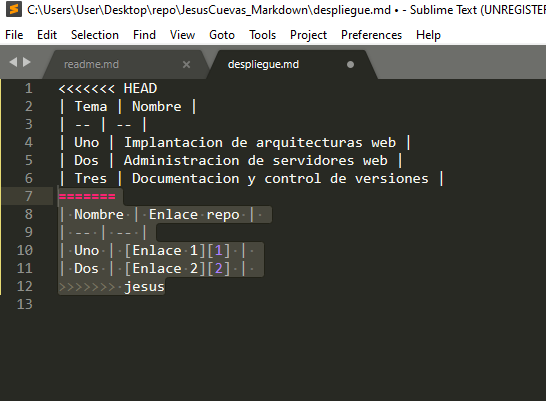
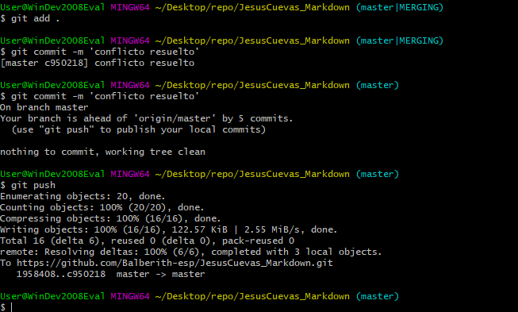
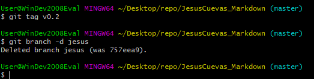

# Primeros pasos
* $ git clone https://github.com/Balberith-esp/JesusCuevas_Markdown.git
* 
* Subida de cambios al repositorio remoto
	* 
	* 
	* 
	* 
* Listado de modulos matriculado
	1. DAW
	2. DWES

* Subida de cambios tag v0.1
	* 

| Nombre | Enlace repo | 
| -- | -- |
| Uno | [Enlace 1][1] | 
| Dos | [Enlace 2][2] | 

[1]:wwww.google.es
[2]:wwww.google.es

#Tarea 2
### Creacion de ramas
1. 
### Creacion de ramas
2. 
### Creacion de ramas
3. 
### Conflicto 
3. 
### conflictoResuelto 
4. 
### v02 
4. 

